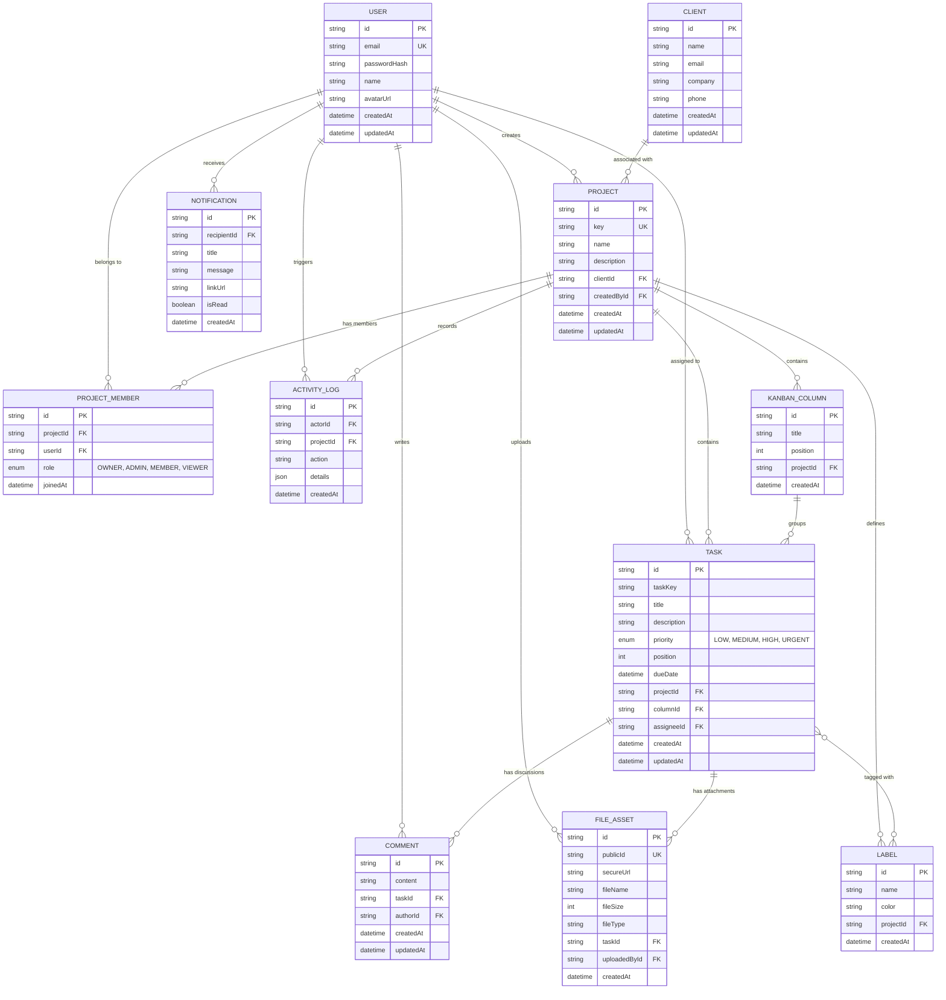

# Tickon - Core Technical Specification

## 1. Monorepo Architecture & Packages

Orchestrated via **Turborepo 2.x** with **pnpm workspaces**.

### Frontend (`apps/client` / `@tickon/client`)
- **Core:** `next@16`, `react@19`, `react-dom@19`
- **Port:** `3000`
- **State Management:** `zustand` (client state), `@tanstack/react-query` (server state)
- **Styling & UI:** `tailwindcss`, `lucide-react` (icons), `sonner` (toasts)
- **Forms & Validation:** `react-hook-form`, `zod`, `@hookform/resolvers`
- **Drag & Drop:** `@dnd-kit/core`, `@dnd-kit/sortable`
- **Real-time:** `socket.io-client`
- **Shared Types:** Consumes `@tickon/types` (`workspace:*`)

### Backend (`apps/server` / `@tickon/server`)
- **Core:** `@nestjs/core`, `@nestjs/common`, `@nestjs/platform-express`
- **Port:** `4000`
- **Database:** `prisma@6`, `@prisma/client@6`
- **Security & Auth:** `@nestjs/jwt`, `passport-jwt`, `bcrypt`, `cookie-parser`, `helmet`
- **Real-time:** `@nestjs/websockets`, `@nestjs/platform-socket.io`
- **File Uploads:** `multer`, `cloudinary`
- **Validation:** `class-validator`, `class-transformer`
- **Shared Types:** Consumes `@tickon/types` (`workspace:*`)

### Shared Contracts (`packages/types` / `@tickon/types`)
- Shared TypeScript data models (`User`, `Project`, `Task`, `KanbanColumn`, `Client`)
- Common enums (`ProjectRole`, `Priority`, `NotificationType`)
- Standard API response types (`ApiResponse<T>`, `PaginatedResponse<T>`, `ApiErrorResponse`)

---

## 2. Database Entity-Relationship Architecture

> Visual map of all models, enums, fields, and relationships in the PostgreSQL database via Prisma.

### Mermaid ER Diagram

## 3. Relationship & Cascade Rules Summary

| Parent Model   | Child Model     | Relation | Constraint / Cascade Action                                     |
| -------------- | --------------- | -------- | --------------------------------------------------------------- |
| `User`         | `Project`       | 1:N      | `Restrict` or ownership transfer before permanent user deletion |
| `User`         | `Task`          | 1:N      | `SetNull`                                                       |
| `User`         | `Comment`       | 1:N      | `SetNull`                                                       |
| `User`         | `FileAsset`     | 1:N      | `SetNull`                                                       |
| `User`         | `Notification`  | 1:N      | `Cascade`                                                       |
| `User`         | `ActivityLog`   | 1:N      | `SetNull`                                                       |
| `Client`       | `Project`       | 1:N      | `SetNull`                                                       |
| `Project`      | `ProjectMember` | 1:N      | `Cascade`                                                       |
| `Project`      | `KanbanColumn`  | 1:N      | `Cascade`                                                       |
| `Project`      | `Task`          | 1:N      | `Cascade`                                                       |
| `Project`      | `Label`         | 1:N      | `Cascade`                                                       |
| `Project`      | `ActivityLog`   | 1:N      | `Cascade`                                                       |
| `KanbanColumn` | `Task`          | 1:N      | `Restrict`                                                      |
| `Task`         | `Comment`       | 1:N      | `Cascade`                                                       |
| `Task`         | `FileAsset`     | 1:N      | `Cascade`                                                       |
| `Task`         | `Label`         | M:N      | `Implicit Join Table` with cascading relation cleanup           |

Important Foreign-Key Nullability

The following fields must be nullable in the Prisma schema because their deletion behavior uses SetNull:
Project.clientId
Task.assigneeId
Comment.authorId
FileAsset.uploadedById
ActivityLog.actorId

---

## 3. Core API Endpoints

### Authentication (`/api/auth`)

| Method | Route                | Purpose                               | Auth Required |
| ------ | -------------------- | ------------------------------------- | ------------- |
| `POST` | `/api/auth/register` | Create a new user account             | No            |
| `POST` | `/api/auth/login`    | Authenticate and set HTTP-only cookie | No            |
| `POST` | `/api/auth/logout`   | Clear HTTP-only authentication cookie | Yes           |
| `GET`  | `/api/auth/me`       | Get current logged-in user profile    | Yes           |

### Projects & Clients (`/api/projects`, `/api/clients`)

| Method   | Route               | Purpose                                      | Auth Required |
| -------- | ------------------- | -------------------------------------------- | ------------- |
| `GET`    | `/api/clients`      | List CRM clients                             | Yes           |
| `POST`   | `/api/clients`      | Create a new client                          | Yes           |
| `GET`    | `/api/projects`     | List projects accessible to the user         | Yes           |
| `POST`   | `/api/projects`     | Create a new project workspace               | Yes           |
| `GET`    | `/api/projects/:id` | Get project details including Kanban columns | Yes           |
| `PATCH`  | `/api/projects/:id` | Update project details                       | Yes           |
| `DELETE` | `/api/projects/:id` | Delete a project                             | Yes           |

### Project Members (`/api/projects/:id/members`)

| Method   | Route                               | Purpose                     | Auth Required |
| -------- | ----------------------------------- | --------------------------- | ------------- |
| `GET`    | `/api/projects/:id/members`         | List project members        | Yes           |
| `POST`   | `/api/projects/:id/members`         | Add a member to the project | Yes           |
| `PATCH`  | `/api/projects/:id/members/:userId` | Update member role          | Yes           |
| `DELETE` | `/api/projects/:id/members/:userId` | Remove a member             | Yes           |

### Kanban Columns (`/api/projects/:id/columns`,` /api/columns`)

| Method   | Route                       | Purpose                           | Auth Required |
| -------- | --------------------------- | --------------------------------- | ------------- |
| `GET`    | `/api/projects/:id/columns` | List project columns              | Yes           |
| `POST`   | `/api/projects/:id/columns` | Create a new Kanban column        | Yes           |
| `PATCH`  | `/api/columns/:id`          | Update column details or position | Yes           |
| `DELETE` | `/api/columns/:id`          | Delete an empty Kanban column     | Yes           |

A Kanban column containing tasks must not be deleted until its tasks are moved to another column.

### Tasks & Kanban (`/api/tasks`)

| Method   | Route                     | Purpose                                                 | Auth Required |
| -------- | ------------------------- | ------------------------------------------------------- | ------------- |
| `GET`    | `/api/projects/:id/tasks` | Fetch all tasks for a specific project board            | Yes           |
| `POST`   | `/api/tasks`              | Create a new task in a specific column                  | Yes           |
| `GET`    | `/api/tasks/:id`          | Get task details                                        | Yes           |
| `PATCH`  | `/api/tasks/:id`          | Update task details                                     | Yes           |
| `PATCH`  | `/api/tasks/:id/move`     | Update task `columnId` and `position` for drag-and-drop | Yes           |
| `DELETE` | `/api/tasks/:id`          | Delete a task                                           | Yes           |

### Labels (`/api/projects/:id/labels`, `/api/labels`)

| Method   | Route                      | Purpose                | Auth Required |
| -------- | -------------------------- | ---------------------- | ------------- |
| `GET`    | `/api/projects/:id/labels` | List project labels    | Yes           |
| `POST`   | `/api/projects/:id/labels` | Create a project label | Yes           |
| `PATCH`  | `/api/labels/:id`          | Update label details   | Yes           |
| `DELETE` | `/api/labels/:id`          | Delete a project label | Yes           |

### Collaboration (`/api/comments`, `/api/files`)

| Method   | Route                     | Purpose                                              | Auth Required |
| -------- | ------------------------- | ---------------------------------------------------- | ------------- |
| `GET`    | `/api/tasks/:id/comments` | Fetch discussion thread for a task                   | Yes           |
| `POST`   | `/api/tasks/:id/comments` | Add a new comment to a task                          | Yes           |
| `PATCH`  | `/api/comments/:id`       | Update a comment                                     | Yes           |
| `DELETE` | `/api/comments/:id`       | Delete a comment                                     | Yes           |
| `POST`   | `/api/files/upload`       | Upload a file to Cloudinary and attach it to a task  | Yes           |
| `DELETE` | `/api/files/:id`          | Remove file metadata and delete the Cloudinary asset | Yes           |

### Notifications (`/api/notifications`)

| Method  | Route                         | Purpose                                 | Auth Required |
| ------- | ----------------------------- | --------------------------------------- | ------------- |
| `GET`   | `/api/notifications`          | List notifications for the current user | Yes           |
| `PATCH` | `/api/notifications/:id/read` | Mark a notification as read             | Yes           |
| `PATCH` | `/api/notifications/read-all` | Mark all notifications as read          | Yes           |

## 4. Real-Time Events

The application uses Socket.IO for real-time collaboration.

### Task Events
task.created
task.updated
task.moved
task.deleted

### Comment Events
comment.created
comment.updated
comment.deleted

### Project Member Events
member.added
member.updated
member.removed

### Notification Events
notification.created

### Column Events
column.created
column.updated
column.deleted

### Label Events
label.created
label.updated
label.deleted

All real-time events must be scoped to the relevant project and authorized against the authenticated user's project membership.

## 5. Core Data Rules

1. TASK.columnId is the source of truth for the task's current Kanban workflow state.
2. A separate TASK.status field is intentionally not used.
3. TASK.position determines ordering within a Kanban column.
4. KANBAN_COLUMN.position determines ordering within a project.
5. TASK.assigneeId may be null when a task is unassigned.
6. PROJECT.clientId may be null when a project has no associated client.
7. COMMENT.authorId may be null when the original author has been deleted.
8. FILE_ASSET.uploadedById may be null when the uploader has been deleted.
9. ACTIVITY_LOG.actorId may be null when the original actor has been deleted.
10. A user must have appropriate project membership before accessing project resources.
11. Only authorized project members can create, update, move, or delete project tasks.
12. Project roles (OWNER, ADMIN, MEMBER, VIEWER) determine permitted project actions.
13. A Kanban column containing tasks cannot be deleted directly.
14. Task-label relationships are managed through Prisma's implicit many-to-many relation.
15. Files are stored in Cloudinary; PostgreSQL stores only file metadata and Cloudinary identifiers/URLs.
16. Passwords are stored only as secure hashes using bcryptjs, never as plaintext.
17. Authentication uses an HTTP-only cookie containing the authentication token.
